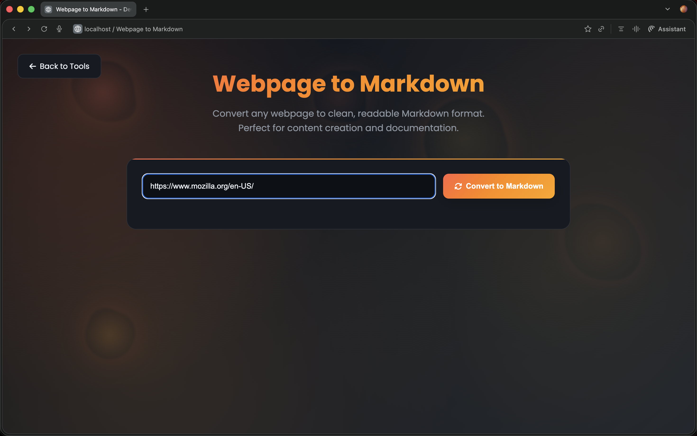
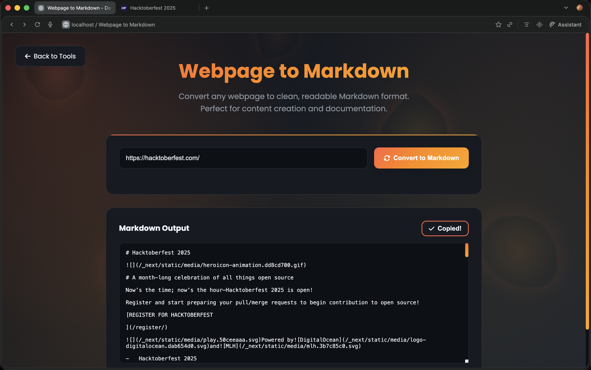
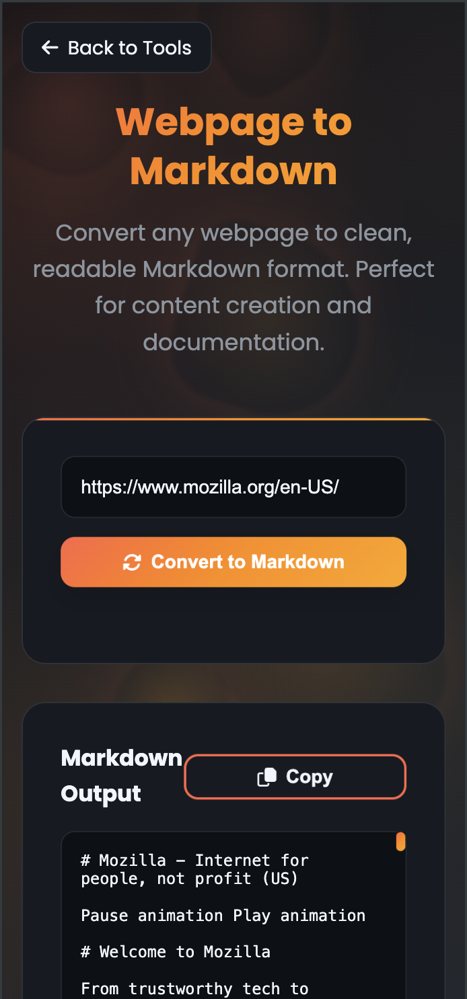

# Webpage to Markdown Converter

A powerful tool that converts any webpage content into clean, readable Markdown format. Perfect for content creation, documentation, note-taking, and content migration.

## ✨ Features

- 🌐 Convert any webpage to Markdown with a single click
- 🛡️ CORS-safe webpage fetching using a proxy API
- 🎯 Smart content extraction with multiple fallback strategies
- 🧹 Advanced content cleanup and formatting
- 📋 One-click copy to clipboard
- ⌨️ Keyboard shortcuts for efficient workflow
- 📱 Fully responsive design for mobile use
- 🎨 Preserves formatting, links, and structure
- 📊 Enhanced table and code block formatting

## 🚀 Usage

### Basic Usage

1. Enter the webpage URL in the input field
2. Click "Convert to Markdown" or press `Ctrl/Cmd + Enter`
3. The converted Markdown appears in the output section
4. Copy the result using the Copy button or `Ctrl/Cmd + C`



#### Step-by-Step Guide

1. **Enter URL**
   

2. **Converting Process**
   

3. **View Results**
   

### Keyboard Shortcuts

- `Ctrl/Cmd + Enter`: Convert webpage
- `Ctrl/Cmd + C`: Copy output (when output is focused)
- `Ctrl/Cmd + V`: Auto-convert on URL paste

### Advanced Features

- **Smart Content Extraction**: Automatically identifies and extracts the main content area
- **Table Formatting**: Converts HTML tables to clean Markdown tables
- **Code Block Handling**: Preserves code blocks with language syntax highlighting
- **Link Processing**: Maintains all hyperlinks with proper formatting
- **List Formatting**: Properly formats ordered and unordered lists
- **Image Handling**: Preserves images with alt text and proper linking

## 🔧 Technical Details

### Content Processing Pipeline

1. **URL Validation**
   - Checks for valid HTTP/HTTPS URLs
   - Ensures proper URL formatting

2. **Content Fetching**
   - Uses allorigins.win proxy API to bypass CORS
   - Handles various HTTP errors gracefully

3. **Content Extraction**
   - Identifies main content using priority selectors:
     ```javascript
     const contentSelectors = [
         'main',
         'article',
         '[role="main"]',
         '.main-content',
         '.post-content',
         '.article-content',
         '#content',
         '.content'
     ]
     ```

4. **Content Cleanup**
   - Removes unwanted elements:
     - Scripts and styles
     - Navigation and footers
     - Ads and social sharing widgets
     - Comments sections
     - Empty paragraphs
   - Cleans broken or empty links

5. **Markdown Conversion**
   - Custom TurndownJS configuration
   - Enhanced table formatting
   - Code block language preservation
   - List formatting improvements
   - Proper heading hierarchy

### Example Output

Input URL:
\`\`\`
https://example.com/blog-post
\`\`\`

Output:
\`\`\`markdown
# Blog Post Title

## Introduction

This is a sample blog post that demonstrates the converter's capabilities.

### Code Example

\`\`\`python
def hello_world():
    print("Hello, World!")
\`\`\`

### Data Table

| Name | Age | Location |
|------|-----|----------|
| John | 25  | New York |
| Jane | 30  | London   |

#### List Examples

- Unordered list item 1
  - Nested item
  - Another nested item
- Unordered list item 2

1. Ordered list item 1
2. Ordered list item 2

> Important quote or callout text

[Learn more](https://example.com/learn-more) about this topic.
\`\`\`

## ⚠️ Error Handling

The tool handles various error cases gracefully:

- 🚫 Invalid or malformed URLs
- 📡 Failed webpage fetches or timeouts
- 🔒 CORS and proxy access issues
- 📭 Empty or invalid content responses
- 🏗️ Malformed HTML structures

## 📝 Notes and Limitations

- Some websites may block proxy access or require authentication
- JavaScript-rendered content may not be captured (static HTML only)
- Some complex layouts or interactive elements might require manual cleanup
- Very large pages may take longer to process
- Some websites may rate-limit or block automated access

### Mobile Responsiveness

The tool is fully responsive and works great on mobile devices:



## 🤝 Contributing

We welcome contributions! If you find a bug or have a suggestion:

1. Check existing issues first
2. Open a new issue describing the bug/feature
3. Submit a PR if you've fixed/implemented something

## 📄 License

This tool is part of the DevToolkit project and is open-source under the same license.